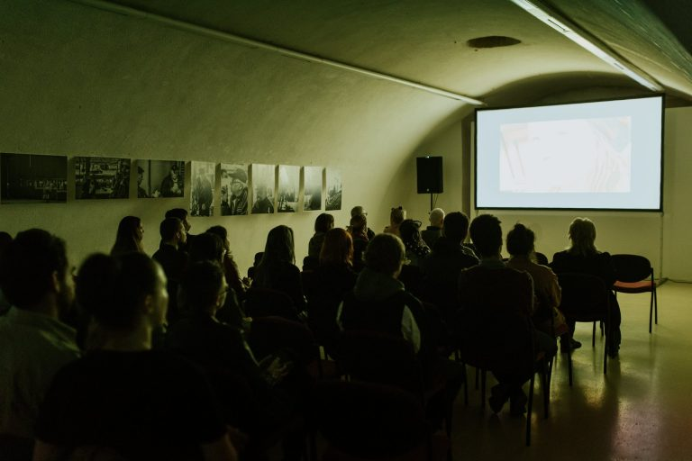

---
title: "Kamera ide, zvuk ide – akcija!"
date: 2019-06-01
slug: cetvrta-filmska-runda
author: Bruno Koić
published: true
description: U Osijeku je sinoć započela 4. Filmska Runda
color: #8e1a1a 
---

U osječkoj galeriji Kazamat sinoć je otpočela dvodnevna revija hrvatskog kratkog filma – 4. po redu Filmska Runda.
Za one koji još nisu upućeni, Filmska Runda festival je kratkometražnog filma u organizaciji udruge Teatar To Go, koja djeluje na području suvremenog kazališnog stvaralaštva i audiovizualne djelatnosti. Festival se ove godine službeno održava kroz dva dana, a osim standardne projekcije filmova, imamo i popratne programe uz radionicu od 28. svibnja do 1. lipnja, samostalnu izložbu fotografija osječkog fotografa Zlatka Balentića, koje su nastajale usporedno sa snimanjem dokumentarnog filma "Osijek – ruka koja daje", koji se također jučer prikazivao prije službenog otvorenja festivala, u 18 sati. Također, za "noćni" glazbeni program zaduženi su DJ Kema i DJ Umbo.

Jučer je, kao i kroz cijeli svibanj, vrijeme naprosto derutno i nezahvalno za održavanje bilo kakvih vanjskih aktivnosti, pa je tako i festival umjesto u dvorištu Kazamata održan u unutarnjim prostorima. Posebno me iznenađuje što su unatoč kiši i promjenjivom vremenu, Osječani popunili sva sjedeća mjesta i atmosfera je bila više nego ugodna i neopterećujuća, što su vrlo uspješno dočarali svi volonteri i organizatori Runde, prvotno besplatnim upadom, kokicama, aperitivima, pristupačnim cijenama alkoholnih i inih pića, uvijek na dispoziciji za sve upite putem info pulta itd. itd.

Moram priznati da mi je ovo prva Filmska Runda u matičnom mi gradu, prošlih godina sam ih propuštao što zbog boravljenja izvan grada, što zbog ostalih neodgodivih obveza, no ove godine sam odlučio prisustvovati pa makar sjekire padale s neba ili eksplodirao neki reaktor u našoj blizini. Odmah ću reći kako, očekivano, nisam pogriješio – Filmska Runda je opušten, vrlo dobro organiziran festival s vrhunskim odabirom filmskog materijala, revija koju preporučujem svakom Osječaninu da je pohodi danas, a ako ne danas, definitivno iduće godine.