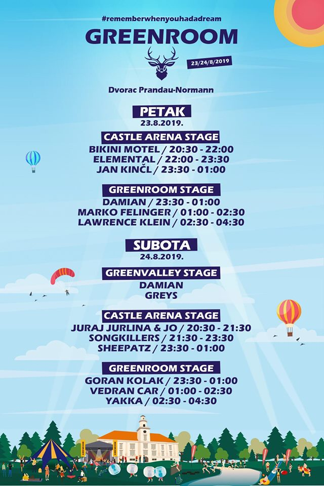

---
title: U srcu Valpova održan sedmi greenRoom festival
date: 2019-08-25
slug: green-room
author: Valentina Stantić
published: true
description: Vrijedna ekipa iz Udruge za promicanje glazbe, sporta, kulture i očuvanja okoliša – greenRoom, na čelu s predsjednikom Ivanom Rajkovićem, i ove godine organizirala je čuveni, sedmi po redu, greenRoom festival za sve ljubitelje elektronske glazbe
color: #3d8c32
---

Udruga greenRoom može se pohvaliti da je njihov festival jedan od najposjećenijih festivala elektroničke glazbe u regiji, a otprilike sumirajući ovogodišnji broj posjetitelja u oba dana, zaključuje se da se zadovoljna publika svake godine vraća, a očigledno dovodi i nove zaljubljenike u raznovrsna glazbena imena koja ovaj događaj nudi. Ono što je potrebno istaknuti je upravo ta raznovrsnost koju ovaj mali festival u srcu grada Valpova nudi. Iako prvenstveno baziran, što se tiče glazbenog dijela, na elektroničku glazbu, organizatori se uvijek potrude da se u line-upu pronađe i nekoliko rap, pop ili rock izvođača koji će privući dodatne posjetitelje. Osim glazbenog dijela, tijekom dana moglo se uživati u sportskom dijelu programa, od napetog Green Volleyball kupa do zanimljivog bubble footballa. Nažalost, zbog tehničkih poteškoća je planirana Extreme Run utrka otkazana, ali uvjerena sam da su ljubitelji sporta bili itekako zadovoljni ponuđenim programom, koji se odvijao u prekrasnoj prirodi nadomak valpovačkog dvorca Prandau – Normann.

Čuveni kompleks dvorca Prandau – Normann je glavna lokacija koja je tijekom dvije ljetne noći, 23. i 24. kolovoza 2019. godine ugostila desetak glazbenih imena, od onih već dobro poznatih do mladih i “svježih” koji su, barem na ovom festivalu, dobili priliku široj publici predstaviti svoju glazbu. Koncept glazbenog dijela festivala bio je podijeljen na GreenValley Stage, glavni Castle Arena Stage i GreenRoom Stage.

Zaključno, greenRoom festival može se navesti kao još jedan slavonski primjer dobre organizacije i kako na zanimljiv način spojiti prirodu i povijest istočne Hrvatske s suvremenom tehnologijom i noćnim životom. Upravo zbog takvih poteza kojima doprinosi i promociji Valpova, festival je priznat kao simbol grada. Još jednom čestitke na organizaciji i veselimo se idućoj godini!