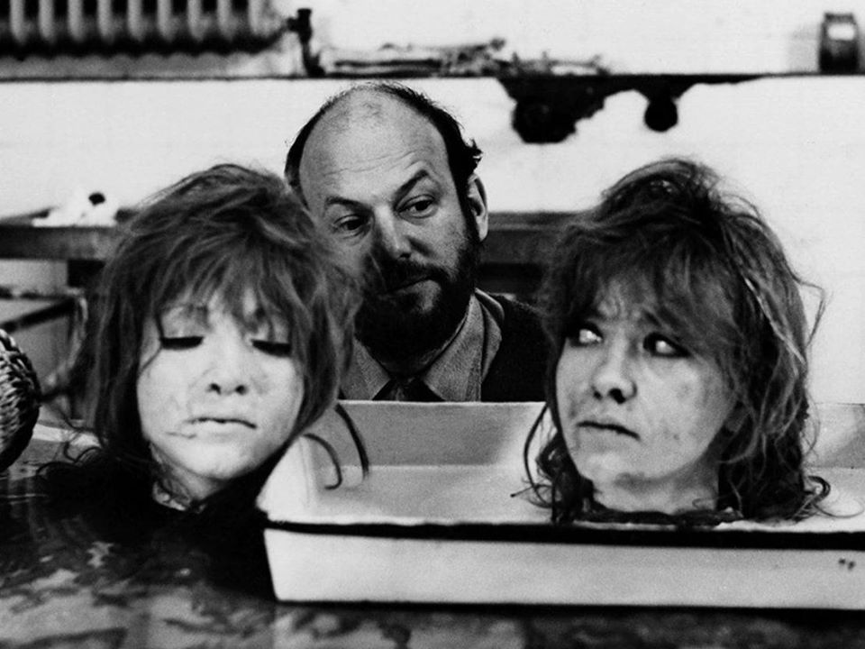

Nakon što je Kino Tuškanac najavilo svoje rujanske projekcije i retrospektive, povodom nove sezone programa Kratki utorak predstavljeno je nešto domicilnije ime – crno-valnog (ili crno-talasnog, ako hoćete) redatelja jugoslavenskog filma, vječno kontroverznog Dušana Makavejeva (1932-2019) bez kojeg smo ostali u siječnju ove godine. Službeni događaj ove manifestacije pod nazivom U carstvu subverzije pronađite OVDJE.

Bit će prikazane projekcije sljedećih filmova (ukupno 81 minuta):

Pečat (1955), 17 min, HD
Antonijevo razbijeno ogledalo (1957), 11 min, HD
Prokleti praznik (1958), 9 min, 35mm
Šta je to radnički savjet? (1959), 13 min, 35mm
Parada (1962), 10 min, 35mm
Ljepotica 62 (1962), 13 min, HD
Nova domaća životinja (1964), 8 min, 35mm