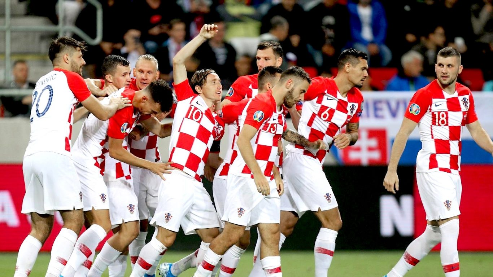

---
title: Presudni faktori sinoćnje dominacije protiv Slovačke
date: 2019-09-07
slug: hrvatska-slovacka
author: Mihovil Topić
published: true
description: Kvaliteta igre je naprosto određena količinom kontrole koju imate na utakmici, a tu je važno tko je s druge strane
color: #007BFF
---

Poanta taktike u nogometu nije ugurati u momčad  11 najkvalitetnijih i najskupljih igrača koji igraju u najboljim klubovima i čije ostavljanje na klupi nećete morati objašnjavati javnosti u slučaju lošeg rezultata. Poanta je izabrati 11 pravih koji će se svojim profilima i igračkim karakteristikama najbolje nadopunjavati, a tu Petković — iako nije univerzalno rješenje za svaki kontekst, posebno ne kad se vrati Kramarić — itekako ima mjesta protiv suparnika kao što je Slovačka, makar opet igrao utakmicu kao što je bila ona protiv Azerbajdžana. Naprosto, specifične kvalitete koje ima u igri leđima i korištenju međulinijskih prostora nema nijedan drugi naš napadač, a one savršeno nadopunjuju one kvalitete koje imaju njegovi suigrači i na taj ih način čini boljima.

A kad se stvari poslože onda dobijete ono što ste vidjeli protiv Slovačke — 31 udarac, četiri gola, tri stative/grede i potpunu dominaciju u kojoj je Hrvatska demonstrirala koliku zapravo kvalitetu ima i kako može gaziti suparnika čistom napadačkom igrom.

