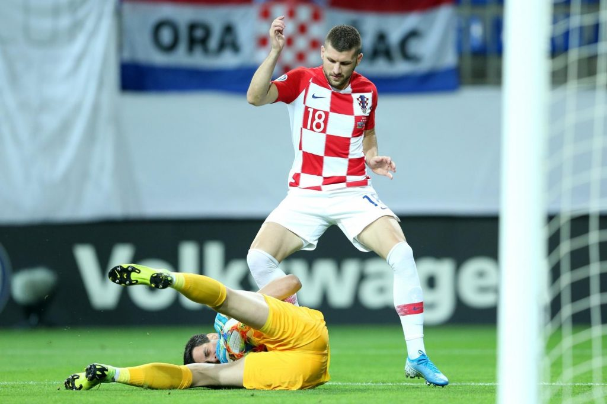

---
title: Nakon razbijanja, šok - Hrvatskoj bod u Bakuu
date: 2019-09-09
slug: hrvatska-azerbajdzan
author: Luka Stanzl
published: true
description: Hrvatska je razbijanje Slovačke popratila kiksom protiv Azerbajdžana u šestom kolu kvalifikacija za Euro 2020
color: #007BFF
---

Hrvatska je razbijanje Slovačke popratila kiksom protiv Azerbajdžana u šestom kolu kvalifikacija za Euro 2020. Utakmica je završila 1-1, a naši reprezentativci postali su tako jedini koji su u ovom kvalifikacijskom ciklusu Azerbajdžanu dopustili bod.

Zlatko Dalić je, očekivano, na teren poslao istu jedanaestoricu koja je razmontirala Slovake u Trnavi, a utakmica se od početka, također očekivano, odvijala po dobro poznatom obrascu; Hrvatska je imala inicijativu, kontrolirala loptu i bila agresivna u presingu, dok se domaćin branio duboko i, pomalo šlampavo, pokušavao zgusnuti linije u najopasnijim zonama pred svojim golom.

S obzirom da im nedostaje kvalitete i izgrađenih šablona za izgradnju napada iz vlastite polovice, Azerbajdžanci su zapravo jedinu pravu šansu da naprave nešto imali u brzoj tranziciji nakon što bi Hrvatska izgubila loptu.

Rezime je sljedeći: dobrih uvodnih 15 minuta, onda pad intenziteta, dopuštanje domaćinu da se vrati u utakmicu i potpuni pad u drugoj polovici nastavka. Nakon sjajnog dojma u Trnavi, ovo je zadnje čemu smo se nadali.