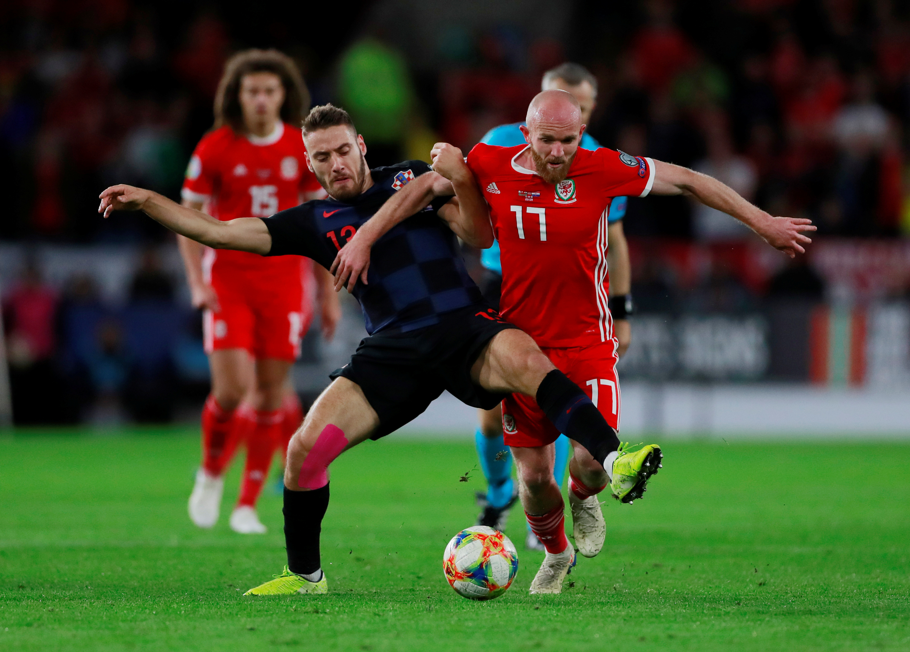

---
title: Hrvatska nogometna reprezentacija osvojila je bod protiv Walesa
date: 2019-10-13
slug: hrvatska-wales
author: Luka Stanzl
published: true
description: Hrvatska nogometna reprezentacija osvojila je bod na gostovanju u Cardiffu, gdje je protiv Walesa odigrala 1-1 (1-1)
color: #007BFF
---

Nikola Vlašić je doveo Hrvatsku u vodstvo u 9. minuti, a u trećoj minuti sučevog dodatka u prvom dijelu izjednačio je Gareth Bale.

Hrvatska je do vodećeg pogotka u 9. minuti stigla u tri poteza. Po lijevoj strani se prema kaznenom prostoru sjurio Josip Brekalo, navukao na sebe pozornost čak četvorice velših igrača, i dodao loptu usamljenom Bruni Petkoviću. Ovaj je proslijedio loptu još prema sredini, gdje je bio Nikola Vlašić, koji je s ruba kaznenog prostora preciznim urarcem pogodio donji desni kut domaćeg gola.

U 13. minuti je vratar Hennessey spriječio Ivana Perišića da udvostruči hrvatsku prednost. Napadač Bayerna glavom je gađao lijevi donji kut, ali je domaći vratar odlično obranio precizan udarac.

Kad se činilo da će Hrvatska na odmor s prednošću, Wales je izjednačio. Ben Davies je u čvrstom startu oteo loptu Mateu Kovačiću na 25 metara, odlično proigrao Garetha Balea koji je u prvom koraku prošao Dejana Lovrena i poslao loptu u suprotni kut pokraj noge Dominika Livakovića.

U posljednjoj utakmici u ovim kvalifikacijama Hrvatska će 16. studenoga na Rujevici ugostiti Slovačku u utakmici u kojoj je našoj reprezentaciji i bod dovoljan za plasman na EURO 2020. U toj utakmici zbog trećeg žutog kartona neće moći igrati Dejan Lovren i Domagoj Vida.