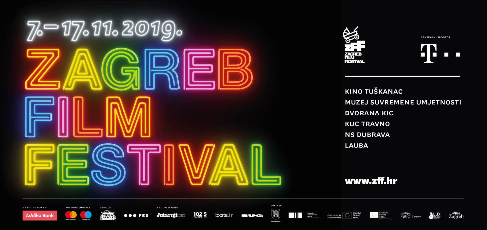

---
title: Uskoro počinje 17. Zagreb Film Festival
date: 2019-11-04
slug: zagreb-film-fest
author: Marko Kaselj
published: true
description: Val filmske vrućine u studenom stiže i ove, sedamnaeste #hotinnovember jeseni!
color: #8e1a1a
---

Nakon više od deset godina, najveća zagrebačka filmska avantura, Zagreb Film Festival, nalazi se na novom početku i u iduće poglavlje ulazi bez najveće i najljepše zagrebačke kinodvorane, kina Europa, ali će zato svoja filmska platna tijekom rekordnih jedanaest dana raširiti na šest lokacija s obje strane Save: u kinu Tuškanac, MSU, dvorani KIC, KUC Travno, NS Dubrava, F22 – Novoj akademijskoj sceni, HUB-u 385 te Hrvatskom glazbenom zavodu. Program ZFF putuje, koji je prošle godine obišao 16 gradova, nastavlja se i ove godine. Tako će nekoliko odabranih naslova iz aktualnog programa biti prikazano u rekordnih dvadeset hrvatskih gradova.

Od svojih početaka ZFF je usmjeren ka otkrivanju i promicanju suvremenog nezavisnog filma i debitantskih ostvarenja redatelj/ica iz cijelog svijeta pa tako u glavnom programu posjetitelje i ove godine očekuju prvi i drugi filmovi talentiranih autora nagrađeni na prestižnim A festivalima, od Cannesa do Sundancea, te zanimljive filmske priče koje pristižu sa svih strana svijeta, od Kolumbije do Norveške.

U glavnom programu dugometražnog igranog filma, među ostalim, otkrivamo film trenutno najtraženijeg nadolazećeg redatelja na svjetskoj filmskoj sceni, mladog ruskog autora Kantemira Balagova, a natjecateljski program Ponovno s nama uključuje nove filmove nordijskih filmskih majstora Roya Anderssona i i Grímura Hákonarsona te miljenika ZFF-ove publike, novozelandskog redatelja Taike Waititija.

I brojni popratni programi ZFF-a nude bezbroj razloga za uživanje u filmskoj umjetnosti. Među njima je Moj prvi film: In Memoriam u čast velikanima svjetskog filma koji su nas napustili u posljednje dvije godine: Milošu Formanu, Dušanu Makavejevu, Agnès Vardi, Georgeu A. Romeru i Nicolasu Roegu, program Bibijada namijenjen najmlađim filmoljupcima ove godine u potpunosti je posvećen temi ekologije dok će novi popratni program Fragmenti egzila pokazati kako su na ovaj fenomen reagirali glasoviti europski filmaši poput Reinera W. Fassbindera ili Ulricha Seidla.”

NATJECATELJSKI PROGRAM

Glavni program – međunarodni debitantski dugi i kratki filmovi
Kockice – program kratkih filmova hrvatskih autora/ica
Ponovno s nama – novi filmovi autora čija smo prva i druga ostvarenja gledali na ZFF-u
PLUS – odabrali mladi filmofili

POPRATNI PROGRAM

Velikih 5 – aktualni filmovi iz pet najvećih europskih kinematografija (Francuska, Italija, Njemačka, UK i Španjolska)
Dan LUX filma – tri finalista izbora Nagrade LUX
Moj prvi film: In Memoriam – prvijenci velikana svjetskog filma koji odnedavno više nisu s nama
Bibijada – popularni program europskih igranih filmova za najmlađu publiku
Fragmenti egzila – filmovi glasovitih europskih filmaša na temu egzila
Festivali pod reflektorom – selektori značajnih europskih festivala (Venecija, Locarno…) biraju filmove za zagrebačku publiku