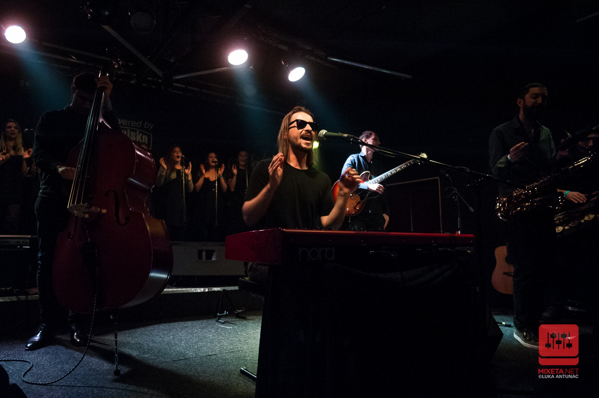

---
title: J. R. August – promocija svjetskog kalibra
date: 2019-11-16
slug: jr-august
author: Luka Antunac
published: true
description: Sinoć je u zagrebačkom Vintage Industrial Baru zabočki kantautor Nikola Vranić, poznatiji kao J. R. August održao koncertnu promociju debitantskog albuma pod nazivom “Dangerous Water” koji je objavljen za diskografsku kuću Croatia Records
color: #3d8c32
---

Točno u 22:00 na pozornicu se ušuljao zbor, a za njim J. R. August koji sjeda za klavijature, stavlja svoje “Raybanice” i otvara koncert zborskim pjevanjem “Fisherking” koja je ujedno i prva numera na već spomenutom albumu. Slijedi zaigrana “The Brown Trout And The Nightingale”, a na pozornicu izlaze Lujo Parežanin na tenor saksofonu i Marko Gudelj na bariton saksofonu koji odlično začinjavaju atmosferu. Zatim dolaze gitarist Pavle Miljenović, basist Ivan Džajić i bubnjar Borko Rupena te u konačnom večernjem sastavu započinju simbolično “Let’s Get Together“.

Bilo je mjesta i za ostale skladbe koje nisu na albumu, pa smo tako imali prilku čuti jednu od ranijih “Distort Reality” za koju duhovito kaže da je nastala u polju citrusa. Bio je tu i gotovo cijeli fenomenalno mračan boogie EP “Tea Party With Mr. Death“. Zasvirao je i uvijek dobrodošao opsjedajući “The Exorcist” koji uvelike raspameti publiku.

Nastavljamo dalje uplivavati u “opasne vode” te nas vodi u prekrasnu “River Runs Through“, a zatim tonemo u “When I Wake Up Tomorrow“. Svakako treba spomenuti fenomenalan The Invisible zbor koji predvodi simpatični Sebastian Jurić. Oduševljavali su sve prisutne svojom energijom i svako malo nas pozivali da pucketajući prstima lovimo ritam. Pavle je na gitari svojom tehnikom slidea odlično naglašavao ambijent pojedinih skladbi tijekom koncerta, a bubnjar Borko nas je uvlačio u priču s razno raznim perkusijama.

Na kraju je usljedila već dobro znana “Crucify Me” i naslovna “Dangerous Waters” s kojom završava dvosatna magija. Sretni smo što je prostor Vintage Industrial Bara bio popunjen skoro do zadnjeg mjesta. Kada se radi o ovakvom umjetniku kao što je J. R. August, rekli bi da zaslužuje puno veće dvorane i to one svjetske, jer za ove manje je odavno prezreo. Svaki ton i emocija je bila na mjestu. Bila bi velika šteta da njegova glazba ne prepliva granice, jer ovo je bila promocija svjetskog kalibra.