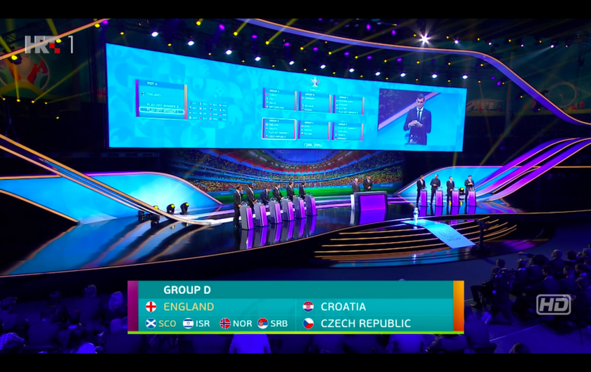

---
title: Hrvatska u skupini s Engleskom i Češkom
date: 2019-11-30
slug: hrvatska-zdrijeb
author: Mihovil Topić
published: true
description: U Bukureštu je održan ždrijeb za nadolazeću europsku smotru
color: #007BFF
---

Imamo dojam kao da je Svjetsko prvenstvo u Rusiji završilo prije par tjedana, a već nam u susret hrli novi Euro. Zapravo mi hrlimo njemu, ali razumijete što želimo reći.

Europsko prvenstvo, na kojem će Portugal braniti krunu, odigrat će se sljedećeg ljeta diljem Europe u novom, proširenom formatu. Sljedeće godine je 60 obljetnica prvog Eura, tako da će se natjecanje održati u 12 europskih gradova.

Danas smo, ždrijebom u Bukureštu, saznali i kako će izgledati skupine. Hrvatska, koja je bila u drugom šeširu, igrat će s Engleskom, Češkom i s pobjednikom plejofa između Škotske, Norveške, Izraela i Srbije.

Hrvatska će biti u skupini D, a prvu utakmicu će odigrati 14. lipnja na Wembleyju protiv Engleske. Ostale dvije utakmice Hrvatska igra u Glasgowu.

Euro počinje 12. lipnja 2020. u Rimu utakmicom Italije i Turske.