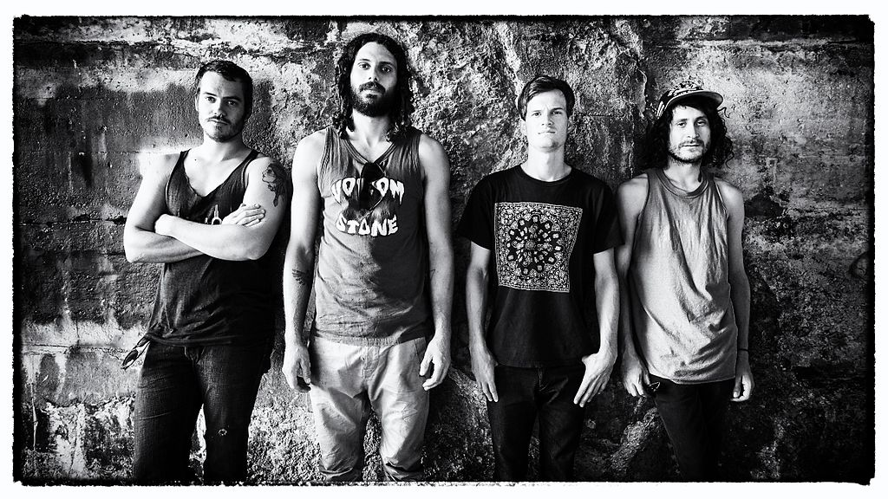

---
title: Sve te vještice i All Them Witches u Močvari!
date: 2019-12-05
slug: all-them-witches
author: Luka Starčević
published: true
description: Trojka iz Nashville, Tennesseea All Them Witches sinoć je pomela do kraja popunjenu Močvaru
color: #3d8c32
---

Bend nastaje na samom početku 2012. godine kada se Charles Michael Parks JR. (vokal/bas) i Robby Staebler (bubnjevi) zbliže radeći zajedno u jednom hippy dućanu. Njihovi zajednički jammovi na kojima im se pridružio i gitarist benda Ben Mcleod ubrzo pronalaze put do kultne Njemačke glazbene etikete Elektrohasch (Stefan Koglek/Colour Haze) koja će im izdati prvi studijski album Our Mother Electricity što će ih učiniti prvim američkim bendom koji će surađivati s navedenom etiketom.

Sedam godine poslije, bend iza sebe ima pet studijskih albuma i dva live izdanja. Povodom njihovog posljednjeg studijskog albuma ATW (2018. – New West) bend kreće na turneju koja ih napokon dovodi i do nas u Zagreb, a s obzirom na sold out gig sumnjam da je njihovo sinoćnje gostovanje bilo i posljednje u našim krajevima.

Ispričavam se momcima iz Koprivnice Acid Hags što sam propustio njihov nastup, jedino na što sam stigao je bila njihova posljednja izvedba i momentalno me ponio fantastičan psych-prog jam koji su momci servirali. Bend postoji od 2016. godine i za sada imaju jedan studijski album West (2018.), a sljedeće godine nas vjerovatno počaste i drugim studijskim albumom.

Osobno nisam očekivao ovakav zagrebački interes za nastup ATW-a. Brojne stoner/garage-blues/psihodelične svirke u Zagrebu prođu relativno skromno posjećenima, no čini se da i dalje postoji neka nit koja veže Zagreb i coprnice ili sve što ima veze s njima. U ovom slučaju, veza je bila furiozna glazbena eksplozija koja dolazi iz Nashvillea, grada poznatog uglavnom po country glazbi. Bez obzira na sinoćnji crossover žanorva, countrya nije bilo.

Ne slučajno, netom prije izlaska benda na pozornicu, kroz zvučnike su nas nabrijavale uvodne minute War Pigsa legendarnih Black Sabbatha. Trojka tada dolazi na pozornicu uz gromoglasno oduševljenje Močvare i uslijedilo je sat i 20 minuta moćne garažne psihodelije popraćene sabbathovskim riffovima i masnim stoner dionicama. Osobno mi najviše pažnje oduzeo gitarist Mcleod koji je svakoj izvedbi sinoć dao svoji snažan pečat svojim gitarističkim virtuoznostima. Na momente Ben djeluje poput Jack Whitea, pogotovo u tim garažnim elementima, samo što za razliku od Jacka, Ben ima snažnu bas potporu od strane vokala Charlesa i bubnjara Robbiea, koji nasuprot „sramežljive“ Meg, zaista razbija bubnjeve ispred sebe, te tako ujedinjeni, bend stvara eksplozivan kolaž čas masno stonerske, a čas psihodelične svirke u kojoj lako odlutate u nebesa, poput vještice na metli.

S kompletnom set listom nisam upoznat, ali primjetio sam cover Hendrixove  Manic Depression te osobne favorite Diamond i Alabaster koje jebend odsvirao i time prekrižio moje želje i očekivanja. Kroz Diamond se provlači upečatljivo miroljubivi psihodelični riff do trenutka kada pjesma eksplodira u stoner bombu. Na Alabasteru Charles poziva publiku na ples jer pjesma ima taj neodoljivo keči zvuk gitare koji onda bude u par navrata isprekidan hard-rock momentom što savršeno upotpunjuje pjesmu.

Reakcije publike su bile odlične. Zaista se stvorila neka kohezija između benda i publike, zbog čega se i sam Charles u više navrata zahvalio publici s obzirom da se radi o njihovom premijernom gostovanju u Hrvatskoj. Ako bih tražio neki minus sinoćnjeg giga onda bi to bio onaj pohlepni minus koji se tiče samog trajanja koncerta. Možda bar da su svoji bis produžili s još jednom izvedbom. U nekom savršenom scenariju to bi bio opet cover Hendrixa kroz Vodoo Chile ili predivna Harvest Feast koja priziv Allman Brothers Band. 50 – 70 manje ulaznica možda bi isto bila sretnija opcija, zbog pretjeranih gužvi kod garderobe (zahvale još jednom ljubaznoj dami što mi je uzela i smjestila kaput kod pozornice) ili za šankom, no zašto ne omogućiti što većem broju ljudi da dožive sinoćnji začarani glazbeni spektakl?!