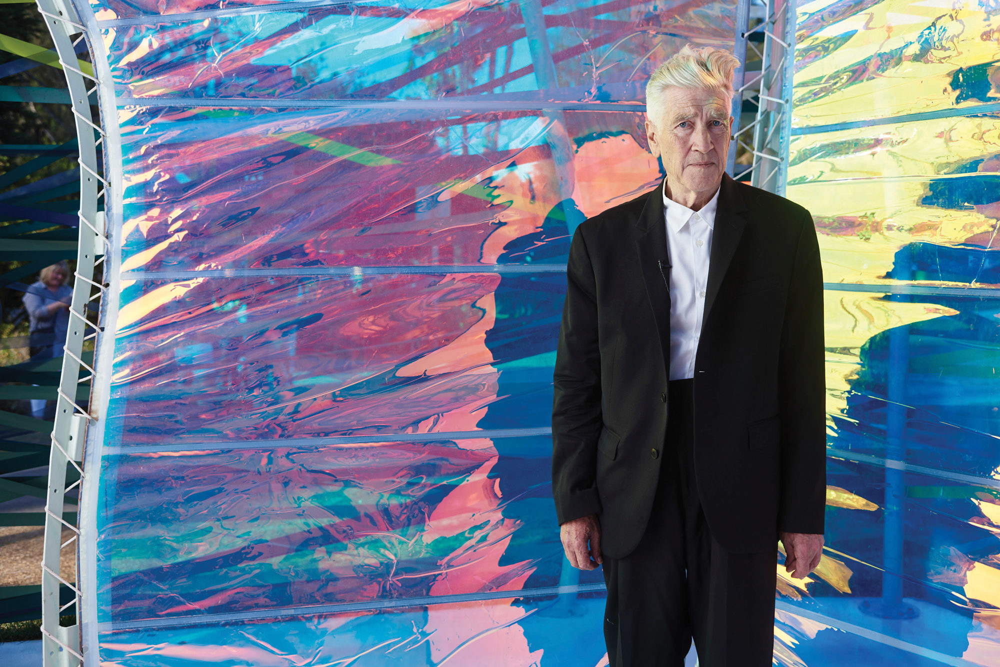

---
title: David Lynch konačno dobiva Oscara
date: 2019-06-05 
slug: david-lynch
author: Marko Kaselj
published: true
description: Veliki redatelj David Lynch, “prvi popularni nadrealist”, kako ga je nazvala utjecajna filmska kritičarka Pauline Kael, zaslužio je svog jedinog Oscara
color: #8e1a1a 
---

Bio je već Lynch (73) više puta nominiran za redateljskog Oscara, i to za Elephant Mana (1980), Blue Velvet (1986) te Mulholland Drive (2001), ali niti jednom nije bio laureat najprestižnije filmske nagrade. Tako će ostati sve do listopada ove godine, budući da ga je Akademija predložila za počasnog dobitnika, zajedno uz glumicu Geenu Davis, glumca Cherokee porijekla Wesa Studia te talijansku redateljicu/scenaristicu Linu Wertmüller.

Lynch, koji se proslavio kao redatelj iznimno nadrealnih filmova, ispunjenih košmarnim, snovitim sekvencama i bizarnim scenama, istaknuti je vizualni umjetnik i mimo filmskog medija, budući da je objavljivao glazbene albume te održavao izložbe svojih fotografija i slikarskih napora.

Kao filmaša, krasi ga iznimna autentičnost i originalnost, utoliko da postoji epitet “lynchevski” koji dočarava tu mističnu, okultnu notu filmova koje potpisuje (s izuzetkom The Straight Storyja, eventualno), a koliki utjecaj je u mediju ostvario svjedoči cijeli niz mlađih redatelja i filmskih djelatnika koji ga nerijetko navode kao glavnog uzora

Nakon više od 50 godina bavljenja filmom, za vrijeme kojih je iznjedrio niz kultnih filmova i epski serijal Twin Peaks, konačno je dobio nagradu koju je svojim općenitim radom zaslužio puno prije.