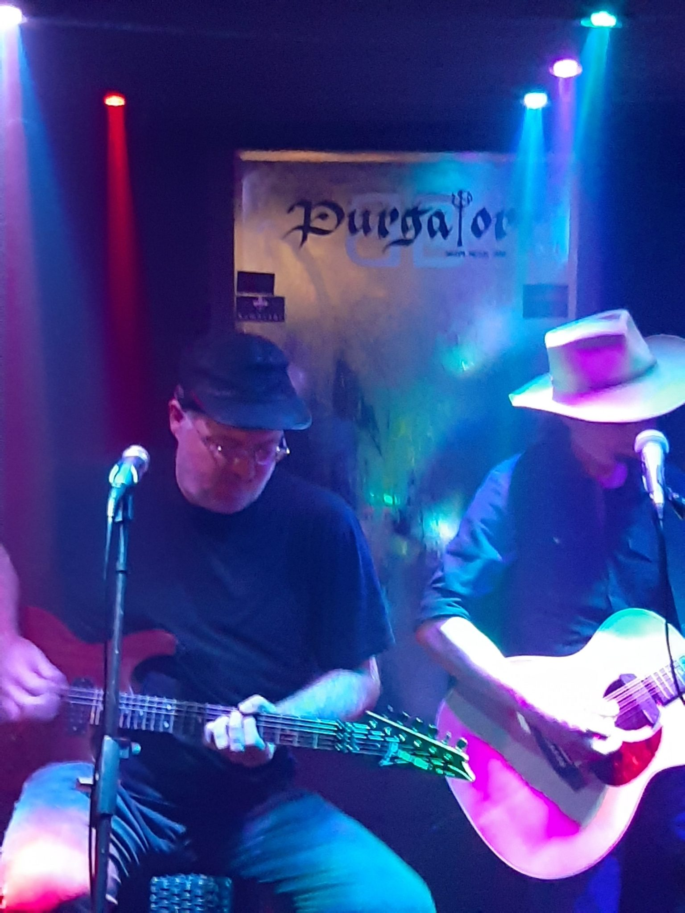

---
title: Predbožićno druženje uz Živo Blato
date: 2019-12-21
slug: zivo-blato
author: Goran Odrljin
published: true
description: Godina se polagano bliži kraju i vrijeme je darivanja
color: #3d8c32
---

Tim povodom je metal bar Purgatory odlučio darovati svojim posjetiteljima jednu rock/metal/folk poslasticu – Živo Blato/Vuco live u akustičnom izdanju za najveće fanove lika i dijela Generala Vasilija Mitua.
Siniša Vuco i njegov alter ego,General Vasilije Mitu imaju gotovo mitološki status među svojim fanovima. Prisjetimo se samo popularnog “KJV” pokreta koji je nadišao svoje začetke kao  Facebook fan stranice i dogurao do “KJV” internet radio stanice i vlastite kopije Facebooka, zvane “Vucobook”.  Koji hrvatski pop/rock/metal/rap izvođač se može pohvaliti da je imao toliko strastvene fanove, da su osnovali cijelu jednu radio stanicu samo za puštanje njegovih pjesama i pjesama sličnih glazbenika?  Točan odgovor je, nitko osim Generala Mitua aka Siniše Vuce.

Većina mlađih fanova zna Vucu kao zabavnjačkog glazbenika koji je imao jedan metal “side” projekt s kojim je izdao jedan jedini studijski album. Brutalan, rokerski prljav, kultni, i dan danas jedan od ponajboljih metal albuma -ali jedan jedini. No evo jedan fun fact; prije nego je prešao u zabavnjačke folk vode, Siniša Vuco je davne 1982. godine svirao u trash metal bandu zvanom “Evil Blood” te par godina kasnije u još jednom metal bendu, zvanom “Witchcraft“. Ovo sve pišem jer unatoč popularnom mišljenju, Siniša Vuco ima više poveznica s metal nego s folk glazbom.

Bilo je i nekoliko ekskluziva s kojima su svi prisutni bili počašćeni. General Mitu je najavio da za još nenajavljeni metal festival u Močvari ponovno okuplja svoj “one time” bend Klanje Ljudi specijalno za potrebe tog festivala koji bi se navodno trebao održati u petom mjesecu. Uz to dobili smo i dvije nove, neobjavljene, pjesme Živog blata! Jedna je posvećena Generalovom pokojnom žutom mačku, a druga je cinična (jer kakva drukčija može biti) posveta dalmatinskoj “pismi”.

Ako se kojim slučajem pitate kad će sve to, zajedno sa Kasapom iz Đakova i ostalim stvarima izaći u studijskom obliku, eh….komplicirano je. Iako je ovaj put General Mitu mudro šutio oko bilo kakvih novosti vezanih za drugi studijski album, više puta je album najavljivan kao “gotova stvar” spremna za distribuciju. Čak je bilo nekoliko fiksnih “deadline” rokova za izlazak, ali svi rokovi su došli i prošli bez traga novog albuma.

Optimist će reći da album samo što nije izašao i da je samo pitanje pravog tajminga a pesimist će reći da su veće šanse da Ivan Pernar postane predsjednik Republike Hrvatske. Istina, kako bi rekao jedan drugi kandidat za titulu predsjednika, je voda duboka.

Ovo nije bio veliki metal koncert s cijelim bendom, velikom binom u nekoj velikoj dvorani. Ovo je bila hrvatska verzija “MTV Unplugged” emisija. Glazbenici, minimalna oprema i najveći fanovi u nekom manjem klubu gdje dolaze baš pravi ljubitelj metal zvuka.