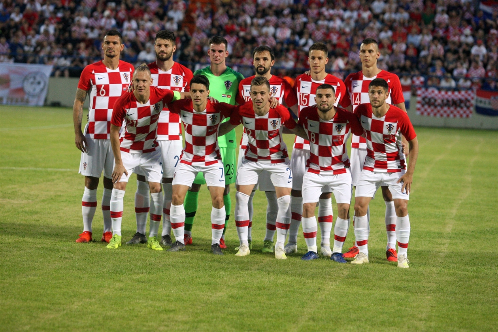

---
title: Hrvatska izgubila u Varaždinu, Tunis nas nadmudrio kontrama
date: 2019-06-11 
slug: hrvatska-tunis
author: Ivan Šarac
published: true
description: Hrvatska nogometna reprezentacija je poražena 2-1 u Varaždinu od Tunisa
color: #007BFF 
---

Hrvatska nogometna reprezentacija je poražena 2-1 u Varaždinu od Tunisa. Prvi je to poraz naše reprezentacije od jedne afričke momčadi, ali i prvi poraz za Vatrene u baroknom gradu Nakon četiri godine Hrvatska se vratila u Varaždin, ali nije barokni grad ovoga puta bio sretan za Vatrene! Prvi put je u Varaždinu Hrvatska poražena, bolji je s 2-1 bio Tunis. Gledali smo dva potpuno različita poluvremena. U prvom je Zatko Dalić isprobao novu formaciju 3-5-2, od prve minute na teren poslao tri debitanta - Simona Slugu, Darija Melnjaka i Filipa Benkovića. Nije se to pokazalo pretjerano dobrim, posebno jer su Tunižani znali iskoristiti nedostatak bekova i brzim su kontrama probijali sa svih strana i stvarali probleme obrani. Poveli su iz jedne takve bre akcije u 16. minuti. Wahbi Khazri je primio loptu na centru i odigrao dupli pas s Youssefom Msaknijem. Vida i Benković su zaostali za Alžircima, Khazri je ponovno dodao Msakniju koji šalje loptu na desnu stranu Badriju. Sluga je rukom uspio dirnuti loptu, ali samo da je odbije u mrežu. Nastavili su prijetiti Tunižani do kraja poluvremena, Hrvatska nije mogla do prilike, kada god bi se Vatreni približili golu, gosti bi ih zatvorili. Nekoliko njih bi ekspresno okružilo našeg igrača sloptom u nogama. Zabilježen je u prvom poluvremenu tek jedan pokušaj, imao ga je Milan Badelj odmah na početku, ali ni on nije išao u okvir gola. 

