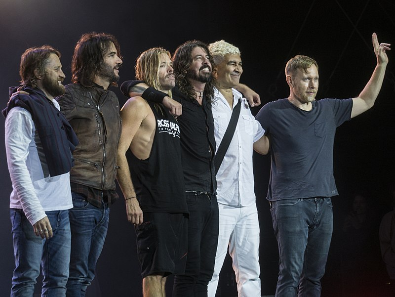

---
title: Foo Fightersi u pulskoj Areni – I to se dogodilo
date: 2019-06-20
slug: foo-fighters
author: Marko Kaselj
published: true
description: Konačno su se dogodili i ti dani, dvodnevlje 18. i 19. lipnja, kada je nesumnjivo najveći stadionski rock bend današnjice, američki Foo Fightersi, uveličao već samu po sebi magičnu lokaciju pulskog amfiteatra
color: #3d8c32
---

Na stranu ću ovom prilikom ostaviti dio seta svojih promišljanja o Foo Fightersima i njihovom frontmanu Daveu Grohlu, koja se djelomično kose s onim jučer viđenim i doživljenim. Koliko god to bilo teško, skrušena srca priznajem kako je ovaj dvostruki koncert očito bio potreban velikom broj fanova iz Lijepe naše i okolice (iako je bilo mnogo onih koji su potegnuli i od dosta udaljenijih mjesta) još od dana kad je najavljen i kad je prouzročio čitavu ludnicu neviđenih razmjera za jedan koncert u Hrvatskoj.

Karizma, ali najviše dobrohotnost jednog Davea Grohla, u potpunom je nesrazu s onim antagonizmom koji smo navikli gledati kod poznatih rokerskih frontmena, a to je bilo nešto što me uvijek lagano brinulo kod njega, ta neka pomama za njim, glazbenim Keanu Reevesom. Kažem, sve neka ide po strani, jer je čovjek nesumnjiva veličina – od početaka 90-ih, kad je bio golobradi bubnjar tih manijaka iz Seattlea, čiji se prljavi, buntovnički grunge imidž uvijek kosio s imenom Nirvana, sve do danas kada je od jednog, meni u očima i ušima dosadnjikavog benda, napravio ponajveću atrakciju iz domene žanra koji je već neko vrijeme na svojim konopcima.

I da budem iskren – da sam svjedočio jednom od najvećih koncerata u svom životu – pa, produkcijski zasigurno. Iako u meni ostaje žal za prvim koncertom, jer sam vjerovanja da su ipak najbolje od sebe dali dan prije, u utorak. Ali nekako mi se koncert, unatoč veličini benda, unatoč magiji lokacije i svim ostalim parametrima I varijablama, nije učinio nečim što će mi čak i na kraju godine biti najbolji koncert u 2019.

Ipak, treba pohvaliti organizaciju Los Angeles Agencyja, od prvog dana i najave koncerta, pa sve do ovog produkcijskog pakla u Areni. Organizirati da svi uđu (relativno) na vrijeme, jer su redovi bili ogromni, da svi budu usluženi, da čaše za pivo (30kn, ali hajd, donekle mi je jasno) budu perive a ne plastične (trend koji je u Europi na snazi već neko vrijeme, kakav je i kod nas prisutan na nekim festivalima, kao što je recimo Hoomstock, po čemu ovaj koncert ipak nije prvi kako je promoviran), sve ovo bilo je iznimno zahtjevno, a po prihvatljivoj cijeni za ulaznicu. Jedini veći minus organizatora koji bih se usudio spomenuti bio je punkt sa sanitarnim čvorovima, koji je bio prenapučen u gotovo svakom trenutku, jer je bilo uistinu previše ljudi na naprosto premal broj Toi-Toija.

 

Neka hvala Daveu Grohlu i Foo Fightersima – za mene ostaju relikt nekih, za rock boljih vremena, kojih se ne sjećam jer u njima nisam živio, ali da je lijepo imati štimung gotovo trosatnog, stadionskog koncerta na ekskluzivnoj lokaciji u Puli – itekako je dobar osjećaj. Nosat ću ga kroz život, pa koliko god da mi trebalo da cijelo jučerašnje iskustvo još jednom bude evaluirano u glavi.