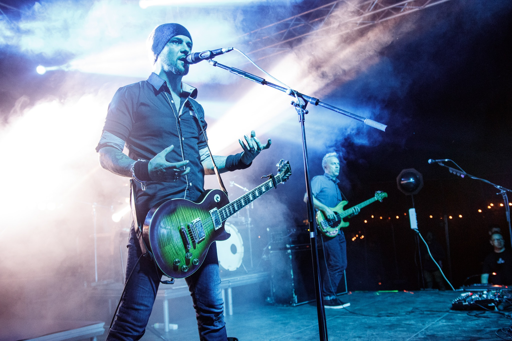

---
title: 14. INmusic, dan 1 - otvoren festival uz Foalse
date: 2019-06-25
slug: inmusic-dan1
author: Bruno Koić
published: true
description: I ove godine zaputili smo se iz Osijeka na jarunski otok mladeži, gdje se tradicionalno održava INmusic festival
color: #3d8c32
---

I ove je godine festival uključio sve sadržaje kao i prošlih nekoliko, a otok nas je dočekao s lijepim vremenom, no zbog prijašnjih loših dana, s mjestimičnim kaljužama, što je naravno uvijek bolja opcija od padalina.

S obzirom na nešto duži put propustili smo prve izvođače poput ovogodišnjih slovenskih pobjednika INmusic breakthrough natječaja, Infected, Paul The Walrus, projekt Borne Mijolovića, umjetnicu u usponu Stephany Stefan te veterane hrvatske punk rock scene – dno. Nakon što smo prošli regulacijski dio festivala i sve provjere te si omogućili beskontaktno plaćanje i pivo po 26 kuna (zamislite, želite uzeti točno 4 piva? Morate uplatiti više od 100 kn, točnije 104, dobra fora, provjerena od prošle godine), američki glazbenik Kurt Vile svirao je već otprilike 20 minuta sa svojim bendom The Violators na glavnom stageu.

Multiinstrumentalist i snažno ime u indie vodama, Kurt Vile široj je javnosti prepoznatljiv kao suosnivač grupe The War On Drugs, no koji se nakon nekoliko godina nakon osnutka odlučio na solo karijeru. Jarunskoj je publici došao predstaviti svoj posljednji studijski album Bottle It In te napraviti presjek dotadašnjeg repertoara. Još uvijek ne tako brojnu, no prilično zainteresiranu publiku Vile je sasvim dostatno i korektno nabrijao na sljedeće izvođače: velški heavy metal bend Skindred na OTP World Stageu, dok su na Hidden stageu svirali riječki sastav Nord.

Za kraj, slovenski sastav Siddharta okupio je brojnu publiku na Hidden Stageu. Siddharta je napravila ono što mi je nedostajalo kod Foalsa; unatoč nekim baladama, za koje nisam siguran imaju li mjesta na festivalima, pogotovo u pola 2 u noći, zračili su oštrom i zaraznom energijom. Repertoar im čine jake i pomalo epske, lako pamtljive melodije, iznimno bogat vokal te pojedinačna instrumentalna snaga, a hrvatska ih je publika možda mogla upoznati preko dueta s Urbanom – Strele v maju.

Za zaključak, prvi dan INmusica odlikovali su kvalitetni bendovi, no dojma sam da je publika u nekim momentima bila sterilna, teško nagovarajuća, a čak smo tri puta dobili “zapovijed” (Skindred, Hives i Foals) da se spustimo na zemlju i postepeno skačemo. S druge strane, uvjeren sam da su fanovi određenih glazbenika došli na svoje, no da šira publika (ona usputna ili koja čeka naredne dane) nije nekako uspjela disati s određenim imenima.

Danas su na redu Suede, Garbage, Thievery Corporation, Frank Turner & The Sleeping Souls, Gato Preto itd. itd…vidimo se.