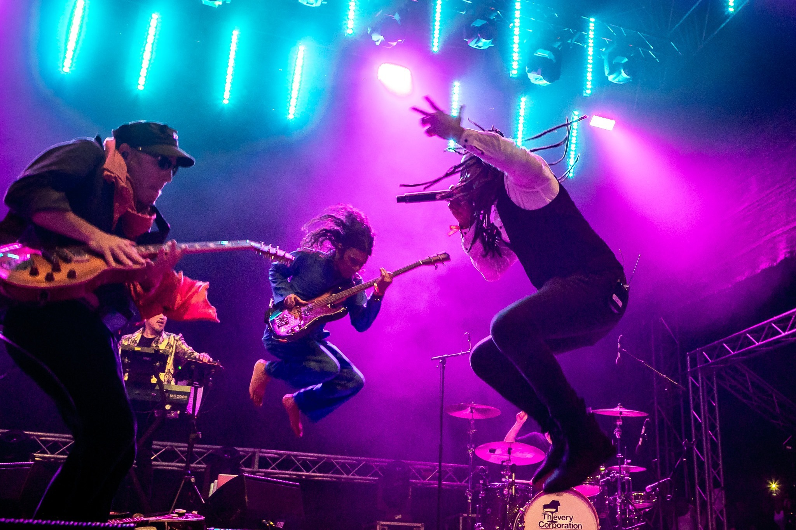

---
title: 2. dan INmusica
date: 2019-06-26
slug: inmusic-dan2
author: Marko Kaselj
published: true
description: Nakon što smo preživjeli festival dosade, prvi dan ovogodišnjeg, 14. po redu INmusica, okrenuli smo se ka središnjem danu festivala
color: #3d8c32
---

Pojedini dojmovi od otvaranja festivala su sažeti, a gorak okus zbog propuštanja Fontainesa itekako je postojan.
Nema veze, utorak je nudio nova uzbuđenja, stoga krenimo redom.

Frank Turner i njegovi the Sleeping Souls bili su kolateralna žrtva tradicionalno ranijeg početka INmusica u odnosu na standardizirane vikend-festivalske satnice. Koliko je dobro, obzirom na radni tjedan, što festival ipak završava u nekom normalnom vremenskom okviru, toliko je ponekad stvar nenavike krenuti što ranije na festival.

Gato Preto (OTP World Stage) tako su bili prvi izvođač na kojem se društvance zateklo. Ova kombinacija, ako sam dobro ulovio, portugalskih državljana afričkog porijekla, imala je sasvim respektabilan performans. Svojim afro-dance ritmovima, u koje su unijeli dašak svakakvog pripadajućeg world-music bućkuriša, pristojno su zaljuljali kukove prisutnih, koji su, sudeći po viđenom, doživljeno itekako odobravali, dapače.

Svakom sa zrncom soli u mozgu jasno je da su ljudi s Crnog kontinenta nekako tradicionalno muzikalniji, što uvelike dokazuje geneza nekolicine glavnih glazbenih žanrova, a dojma sam kako je upravo takav pristup bio poželjniji mnogima nasprav onoga čemu se svjedočili dan ranije – napornoj prepotenciji frontmena najpoznatijeg reklamnog benda današnjice (The Hives), užasno klasičnom i za mene osobno bezličnom, preudžbeničkom i preziheraškom rock sastavu bez imalo autentičnosti (The Foals) te reliktima nekih davnih vremena i slavnijih sastava (Johnny Marr iz The Smithsa) koji na sasvim monetiziran način koriste sveopći antagonizam koji sustavno prati (načelno) glavnog ideologa (Morrissey) sastava kojem su nekoć pripadali. Doduše, budimo iskreni, Moz to više nego zaslužuje; nekad imam dojam da sve radi upravo namjerno.

Teslin toranj, koji je dio festivalske lokacije unazad par izdanja, plijeni poglede svojom strukturom, kojom više pripada Burning Manu kao nekakva instalacija; ununtar konstrukcije se izmijenjuju fotke i spotovi momentalnih izvođača koji se uvijek svedu na nekakve best-of hitove, zatim je tu Šuma Striborova, koja kao da je izdvojeni, skriveni kozmos INmusica koji se povremeno posuđuje goa-trance festivalima. Ima tu klasičnih festivalskih inventara poput bezbrojnih štandova sa zanimljivom gastronomskom ponudom (preporučam indonezijski Satay-poput woka + umak od kikirikija), ponešto skupljom pivskom ponudom, tu je i Silent stage, atrakcija koja mi osobno ne može biti zanimljivija dulje od pet minuta, ali svakome svoje, neki hit-za-hitom stage, Balkan stage sa balkanskim izvođačima te Hidden stage, koji je sve samo ne hidden. Doduše, hidden je ukoliko je njegovo ime nastala kao dio šireg konteksta da se na njemu može pronaći kakav sakriveni („hidden gem“) as među izvođačima.

Što se sinoćnjih izvođača takve vrste tiče, izdvojio bih „post black-metal sreće delta-blues“ bend Zeal & Ardor. Talentirani Švicarac s njujorškom adresom, Manuel Gagneux, oko sebe je okupio zanimljivu grupaciju glazbenika koja prilično uspješno kombinira gore navedeno, naizgled teško spojivo. Nažalost po sebe, uspio sam upiti 15-ak minuta ovog benda, ali mi je bilo nepojmljivo u tom vremenskom rasponu doživjeti growlanje kakvog se ne bi postidjeli najveći metalcore bendovi, koje naslijedi južnjačka, ona baš filmično afroamerička, soundtrack pomirdbe za sudbinom za vrijeme branje pamuka na krvlju okupanoj plantaži Louisiane ili Mississipija, Devil is Fine. Dok glazba u glavi stvara slike, barem u nekom postotku uspjeva u jednoj od svojih funkcija, tako da – big ups za Zeal & Ardor.