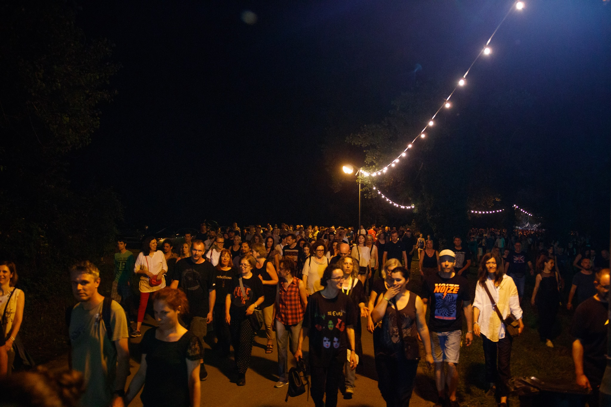

---
title: Veliki The Cure priveli 14. INmusic festival kraju
date: 2019-06-27
slug: inmusic-dan3
author: Valentina Stantić
published: true
description: Treći, ujedno i zadnji dan Inmusic festivala na zagrebačkom Otoku mladosti predstavio je novi niz izvođača
color: #3d8c32
---

Pred nama je bio, po mnogima najuzbudljiviji dan Inmusica zbog glavnog headlinera, britanskog rock sastava The Cure (za one nadam se malobrojne koji nisu upućeni, bend je osnovan 1979. godine i od tada broji veliki broj poklonika, kako među stranom, tako i hrvatskom publikom) zbog kojih je dosta posjetitelja odlučilo kupiti jednodnevnu ulaznicu samo za taj dan, a što se moglo i zaključiti po priljevu ljudi koji se značajno povećao u odnosu na protekla dva dana.

Unatoč tome što su mnogi, kako to već bude na svakom festivalu, došli samo zbog headlinera i odlučili zauzeti prve redove po par sati prije početka njegovog koncerta i možda bili statičniji na koncertima preostalih izvođača koji su nastupali na Main stageu, dobre vibre između publike i izvođača, kao i zanimljive glazbe ovoga dana nije nedostajalo. Oko 20:15h, po rasporedu, na pozornicu se penje američka kantautorica Laura Pergolizzi, svijetu poznata pod umjetničkim imenom LP. Tijekom nastupa od sat i pol vremena LP je uspjela publici dočarati svoju simpatičnost i prizemnost kroz stalnu interakciju, kao i silazak do prvih redova i dijeljenje autograma do onoga najbitnijeg, emociju koja dodatno produbljuje kvalitetu njezine glazbe. Vjerujem da su mnogi koji su se na njezinom koncertu našli u prolazu čekajući drugog izvođača ili poznavajući samo njezinih par radijskih hitova ostali oduševljeni njezinom količinom energije, karizmom i vokalnim sposobnostima. Još jedan dokaz njezine talentiranosti je taj što ju možemo nazvati multi-instrumentalisticom jer kroz nastup kako se mijenjao ugođaj ili brzina pjesme, tako je i LP izmijenjivala instrumente koji su dodatno obogatili zvuk (ukulele, usnu harmoniku, gitaru, itd.) njezinog benda. Svi prisutni imali su priliku uživati u presjeku njezine karijere kroz nove stvari kao što su „When We’re High“, „Muddy Waters“ (pjesme s najnovijeg albuma „Hearth To Mouth“ iz 2018. godine) i dobro znane hitove poput „Lost On You“. Nakon prošlogodišnjeg premijernog nastupa na šibenskoj Tvrđavi svetog Mihovila i ovogodišnjeg na Inmusicu nadamo se da će se odlučiti za skori povratak u Hrvatsku.

Da puno ne duljimo u zaključku, ovogodišnji je INmusic festival predstavio raznovrsnu plejadu aktivnih, nekih aktualnih, većinski neaktualnih izvođača koji su privukli, po slobodnoj procjeni manji broj ljudi nego lani, no opet dostatan da i sljedeće godine festival dosegne koju stepenicu više, ili barem da zadrži epitet najkvalitetnijeg hrvatskog open-air festivala. Veliku stvar dobili su s dovođenjem Curea koji je trenutno na turneji, a podržavamo i dovođenje nekih novih snaga poput Fontaines D.C.-a, Gato Preto itd. itd. Ako ste bili prošlih godina, skoro se ništa nije promijenilo osim par lokaliteta, ponuda hrane i pića primamljiva je strancima, dok je domaći ljudi standardno dočekuju na nož, no unatoč tome što se po prvi put na glavnom stageu dogodio gaf s razglasom, to nije stvar koju možemo uzimati nekome za ozbiljno te ono što je rekla Shirley Manson večer prije potpisujemo: “Mi smo glazbenici. I mi griješimo”. Isto to se odnosi i na tehničare te organizaciju. INmusic, vidimo se ponovno dogodine, a vama svima preporuka da uzmete na vrijeme što povoljnije ulaznice jer za očekivati je da ćete naići na barem 2-3 zanimljiva glazbena imena.