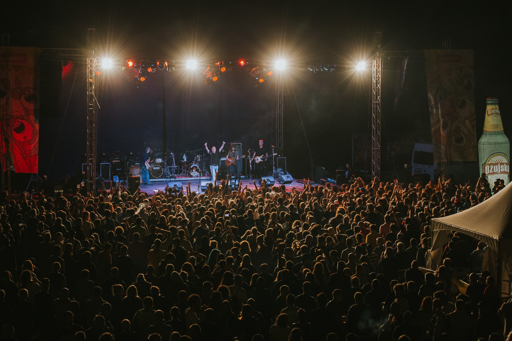

---
title: Slavonska rapsodija zvana Ferragosto Jam
date: 2019-08-06
slug: ferragosto-jam
author: Bruno Koić
published: true
description: Iza nas je još jedno, 12. izdanje najvećeg slavonskog festivala koje godinama dotiče regionalnu razinu. Ferragosto Jam i ove je godine na lijepo Orahovačko jezero privukao tisuće posjetitelja
color: #3d8c32
---

Iz godine u godinu organizatori Dostava Zvuka nastoje posjetiteljima ponuditi nove sadržaje Ferragosto Jam-a, unaprijediti svoju dosadašnju uslugu te prilagoditi program može se reći svačijim „zahtjevima“ i ukusima. Festivalska ulaznica od mizernih 150 kuna idealan je mamac za bilo koju osobu koja drži do kvalitetne domaće glazbene scene. Sve vam govori podatak da ste za jednu divu poput Josipe Lisac na zagrebačkoj Šalati trebali izdvojiti minimalno 150 kuna (što je sasvim razumljivo), a za istu cijenu ćete, ako se potrudite da vam dupe vidi puta, dobiti 50-ak i to kakvih izvođača. Da tu ne brojimo popratne sadržaje poput sporta, kupanja, kampiranja, roštiljanja…i kad se pomisli da se teško može nadmašiti lineup 11. izdanja (Rundek, Tram 11, Hladno Pivo, Let 3, Zdenka Kovačiček, Jinx, Pipsi i brojni drugi), 12. izdanje postepeno je s najavom programa otkrivalo kako će ova godina biti jednako dobra, ako ne i raznovrsnija nego prethodne. Uspješnom zadnjem danu festivala i pametnom „slaganju“ lineupa za nedjelju pogodovao je i praznik u ponedjeljak, pa je tako lineup bio raspoređen tako da svaki dan budete „prisiljeni“ ostati sva četiri festivalska dana.

Prvi dan festivala započeo je u četvrtak uz velikanke dance scene devedesetih, Ivanu Banfić aka I.Bee, Mineu i Ellu kroz program Dance Hard poznatog zagrebačkog rezidenta DJ-a Kneže. Prisutni su mogli čuti brojne uspješnice koje inače možemo čuti na cro-dance slušaonicama u izvornom obliku, a kraljice dance scene obradile su i poneke druge hitove jednako iz te bogate ere. Festival je počeo veoma zanimljivo upravo iz razloga što ćete rijetko gdje moći čuti takav spoj i takve glazbenice na okupu, u aranžmanu nostalgične retro glazbe.

Nema potrebe čitati sve ove retke i vidjeti ono što je već sto puta viđeno i pročitano vezano uz pojedine izvođače, važno je samo sljedeće – Ferragosto Jam morate posjetiti. Za vaše dobro i za smiraj vašeg uma – maknite se iz vaše ljetne svakodnevice, nagovorite minimalno jednu osobu i krenite put Orahovačkog jezera 2020. godine. Vjerujte mi, nećete požaliti. Ako pak niste ljubitelji glazbe, domaće glazbe, kvalitetne domaće glazbe, ako vas BAŠ NIJEDAN bend ne razveseli u lineupu, imajte taj žar u sebi da barem dođete upiti dašak atmosfere oko jezera, na jedan, dva, tri, četiri, a možda kao neki i na tjedan dana. Kao i svaki masovniji festival i Ferragosto ima svoje mane, no nisam još doživio festival koji se uporno iz godine u godinu trudi “pokrpati” sve rupe od prošle godine i tako konstantno napredovati, ili barem održavati prepoznatljivi level i reputaciju tog famoznog “slavonskog Zrća”. Nije Ferragosto slavonsko Zrće, Ferragosto je hrvatski Woodstock. Uvjerite se u to već sljedeće godine.  Vidimo se.