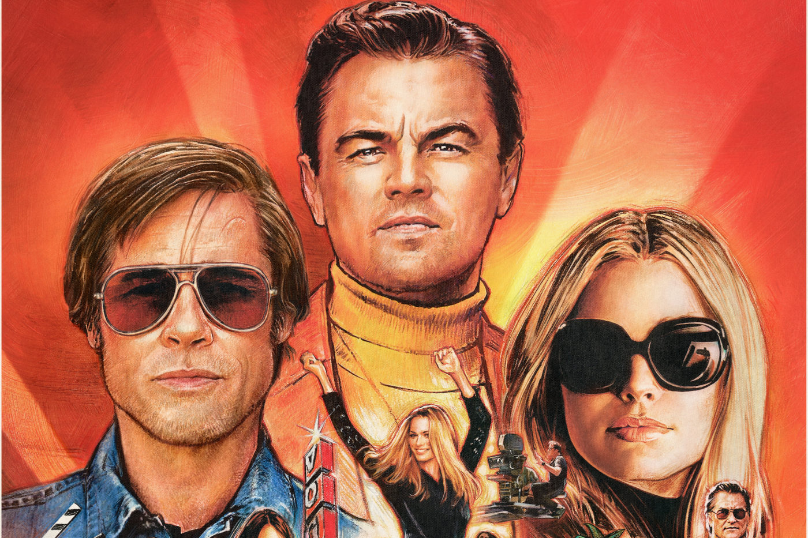

---
title: Novi film Quentina Tarantina srušio rekord u domaćim kinima
date: 2019-08-21
slug: once-upon-a-time
author: Bruno Koić
published: true
description: Domaća publika dočekala je s velikim nestrpljenjem deveti film Quentina Tarantina što najbolje govori podatak da je film u prva 4 dana prikazivanja pogledalo više od 27 tisuća gledatelja
color: #8e1a1a
--- 

Dosadašnji Tarantinov rekorder bio je film Mrska osmorka (The Hateful Eight) s 15.416 gledatelja u otvaranju što znači da ga je Bilo jednom… u Hollywodu prestigao za preko 12 tisuća gledatelja.

U američkim kinima film je do sada zaradio skoro 115 milijuna dolara i time za isti period prikazivanja prestigao dotadašnjeg rekordera “Nemilosrdne gadove” (103.9 milijuna dolara), dok je ukupna zarada na svjetskim kino blagajnama prešla 122 milijuna dolara.

Komentari kritičara su većinom pozitivni, a na vama je da se uvjerite u riječi hvale za ovaj Tarantinov film, koji prikazuje zlatno doba Hollywooda. Kao i uvijek u njegovim filmovima, glumačka postava je legendarna – Leonardo DiCaprio, Brad Pitt, Margot Robbie i mnogi drugi.